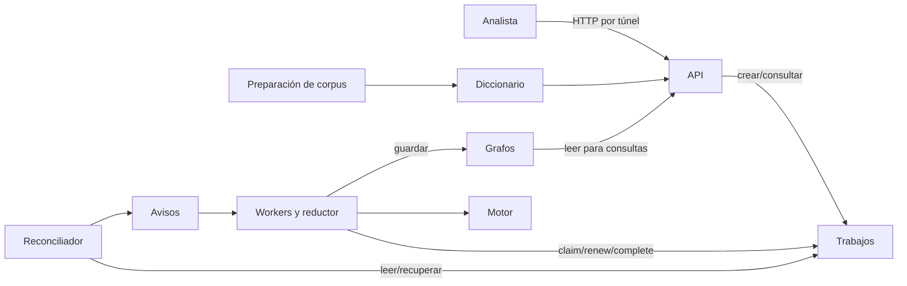

# Arquitectura empresarial de GraphWord

## 1. Alcance, interesados y método

Entrega universitaria de ULPGC: construir grafos de palabras y ofrecer consultas
mediante una API distribuida en AWS. Interesados: estudiante desarrollador/operador,
profesor evaluador y usuario analista. Sus necesidades son corrección, explicación
del diseño, repetibilidad, acceso a una demo y control del crédito de laboratorio.

Se adapta el método ADM de TOGAF al tamaño del proyecto y se usan los conceptos de
capas y relaciones de ArchiMate para organizar las vistas. Es una documentación
adaptada, no una certificación de conformidad ni un modelo ArchiMate validado por
una herramienta. La vista de aplicación y la tecnológica describen código y
recursos reales; la arquitectura objetivo se separa expresamente de lo desplegado.
TOGAF aporta el método; ArchiMate aporta un lenguaje de modelado complementario.
Referencias: [TOGAF, The Open Group](https://www.opengroup.org/togaf) y
[relación con ArchiMate](https://help.opengroup.org/hc/en-us/articles/32115987894930-How-the-ArchiMate-Language-and-the-TOGAF-Standard-Complement-Each-Other).

## 2. Principios y decisiones

| ID | Decisión aplicada | Motivo | Coste o consecuencia |
|---|---|---|---|
| P1 | Motor Python sin dependencia de AWS | Comprobar algoritmos sin nube | Hay que probar también adaptadores |
| P2 | Interfaces de repositorio | Cambiar memoria/SQLite/AWS sin reescribir consultas | Mayor número de módulos |
| P3 | DynamoDB es autoridad; SQS es aviso | Tolerar avisos duplicados o perdidos | Reconciliación periódica y latencia |
| P4 | Objetos de entrada y grafos en S3 | No almacenar grafos completos en registros de coordinación | Descargas y posibles huérfanos |
| P5 | SHA-256 reparte patrones, no bloques de palabras | Preservar conexiones entre palabras de bloques distintos | Cada partición lee todas las palabras |
| P6 | Límites explícitos en búsquedas combinatorias | Evitar bloqueo ilimitado de la API | Un resultado truncado no demuestra optimalidad |
| P7 | Dos EC2 con rol y acceso SSM | Demostrar distribución en Academy sin puertos entrantes | API única, sin alta disponibilidad |
| P8 | Infraestructura declarada y ZIP con hash | Repetir instalación y trazar el código | Cada cambio de release reemplaza nodos |
| P9 | Claves idempotentes y leases renovables | Reintentos del cliente y trabajos largos | No equivale a ejecución exactamente una vez |

## 3. Capa de aplicación

| ID y elemento | Responsabilidad / realización | Interfaces y datos |
|---|---|---|
| A1 API | Recibir construcciones, consultar estados y grafos | HTTP FastAPI `/v1`, OpenAPI `/docs` |
| A2 Motor | Construcción por patrones, BFS, caminos simples, grados, k-core | Funciones Python; grafo de adyacencia |
| A3 Reconciliador | Recuperar reservas caducadas, publicar pendientes, habilitar reductor | DynamoDB/SQS; estados y dependencias |
| A4 Worker | Reservar, renovar, calcular, guardar, confirmar | JobRepository y GraphRepository |
| A5 Adaptadores | Persistencia y concurrencia de trabajos | Memoria, SQLite, AWS |
| A6 Preparación de corpus | Filtrado, intersección y manifiesto | Script; dos fuentes y licencias |
| D1 Diccionario | Entrada normalizada y trazable | Texto versionado / JSON en S3 |
| D2 Trabajo | Estado, intentos, token, lease, revisión, dependencias | DynamoDB; payload con claves de objetos |
| D3 Grafo | Nodos y vecinos / partición o resultado final | JSON en S3, ID confirmado en D2 |
| D4 Evidencia | Pruebas, corpus y benchmarks reproducibles | JSON/Markdown y artefactos de GitHub |

El servicio de construcción lo realizan A1, A3 y A4 usando A2 y A5. El servicio de
consulta lo realiza A1 usando A2 y D3. Las consultas se ejecutan en el proceso API;
no se reparten entre workers. A6 alimenta D1, pero la API permite también una lista
del usuario: normalizar texto en la API no aplica el filtro léxico del corpus.

Las flechas nombran flujos/accesos concretos, no todos los tipos formales de
relación ArchiMate. El reductor es un tipo de trabajo ejecutado por los mismos
workers, no una tercera máquina ni un coordinador que acumula archivos locales.

## 4. Capa tecnológica y correspondencia

| Nodo / servicio | Elemento de aplicación alojado o servido | Configuración implementada |
|---|---|---|
| EC2 A, Amazon Linux 2023 | A1, A3, A4 | t3.micro, Python 3.11, systemd, API loopback |
| EC2 B, Amazon Linux 2023 | A4 | t3.micro, mismo ZIP y configuración compartida |
| S3 privado | D1 y D3 | Cifrado SSE-S3, acceso público bloqueado |
| DynamoDB | D2, coordinación A3/A4 | Transacción padre/hijos y escritura condicional por revisión |
| SQS y DLQ | Avisos a A4 | Entrega al menos una vez, visibilidad renovada |
| SSM | Administración y acceso del analista | Rol de instancia, sin SSH ni ingress público |
| CloudFormation | Configuración de recursos | Pilas storage/compute, nodos por release |
| CloudWatch Logs | Evidencia de órdenes SSM | Retención 7 días; logs continuos en journalctl |
| GitHub Actions | Verificación del código y pipeline CD preparado | Matriz 3.11/3.12, artefactos; CD sujeto a IAM |

Los nodos están en una subred de la VPC por defecto. Tienen IP pública para salida,
pero un grupo sin reglas entrantes. No se afirma aislamiento en subred privada.
EC2 utiliza LabInstanceProfile/LabRole, IMDSv2 y volúmenes cifrados. El rol es el
preexistente del laboratorio: no se presenta como un rol propio de privilegio
mínimo. Antes de producción hay que separar y reducir permisos por componente.

El artefacto es `releases/<sha256>.zip`. Su contenido incluye aplicación, bootstrap,
prueba remota y corpus con licencias. Dependencias directas tienen versiones
fijadas; AMI y dependencias transitivas pueden variar entre instalaciones: todavía
no es un entorno binariamente reproducible ni una imagen totalmente congelada.

## 5. Ciclo de cambio: adaptación del ADM

| Fase | Aplicación concreta a GraphWord | Artefacto / comprobación |
|---|---|---|
| Preliminar / A, visión | Alcance académico, interesados, límites de coste | Secciones 1–2 y enunciado del profesor |
| B, negocio | Analista entrega palabras, construye y consulta; operador mantiene demo | Servicios de construcción/consulta y guía |
| C, sistemas de información | Separación API/motor/jobs/workers y objetos D1–D4 | Catálogo y vista de aplicación |
| D, tecnología | Servicios compartidos AWS y dos nodos de ejecución | Catálogo tecnológico e infraestructura |
| E/F, soluciones y migración | Motor → API → SQLite → particiones → AWS → robustez | Historia Git, pruebas por etapa |
| G, gobierno de implementación | Tests como puerta de CI y validación remota | Informe de pruebas y matriz de requisitos |
| H, cambio | Registrar riesgos y distinguir objetivo de implementación | Lista siguiente; CD condicionado a permisos |
| Gestión de requisitos | Vincular cada requisito con código y evidencia | `rubric-mapping.md` |

Arquitectura inicial: proceso local y estado en memoria. Transición intermedia:
SQLite y procesos separados en una máquina. Arquitectura actual: workers de dos
EC2 con S3/DynamoDB/SQS. Objetivo futuro: API redundante autenticada, workers
autoescalables, índices/outbox en vez de escaneo completo, permisos separados y
observabilidad continua. Esas capacidades futuras no se cuentan como entregadas.

## 6. Calidad, riesgos y aceptación

- Corrección: adyacencia distribuida igual al cálculo de referencia; tests del
  motor contra constructor independiente. Un grafo correcto no prueba rendimiento.
- Robustez: reintentos con límite, tokens por intento, renovación, confirmación
  condicional, reconciliación. No hay transacción conjunta S3/DynamoDB/SQS.
- Escalabilidad: tareas particionadas y comparación uno/dos workers; no existe
  autoscaling. La carga de entrada repetida, el escaneo completo y la reducción
  en una máquina limitan la escala. CPU burst y red influyen en las medidas.
- Disponibilidad: systemd reinicia servicios, pero EC2 A es punto único de fallo
  para API/reconciliador. No se declara SLA. Detener EC2 interrumpe la demo.
- Seguridad: acceso por IAM/SSM, sin credenciales en código; no autenticación
  propia de la API. Idempotency-Key no identifica a un usuario ni sustituye auth.
- Datos: fuentes trazables y avisos íntegros; el filtro es un criterio operativo,
  no una garantía de significado. Persisten posibles objetos S3 huérfanos.
- Operación: pruebas y comandos reproducibles; CD preparado pero bloqueado por
  IAM de Academy. Se requiere aceptación del profesor o una cuenta autorizada.

La aceptación se apoya en la [matriz de requisitos](rubric-mapping.md), las pruebas
automáticas, el [benchmark](performance.md) y el smoke AWS. No se confunden mocks,
mediciones locales y servicios reales.
