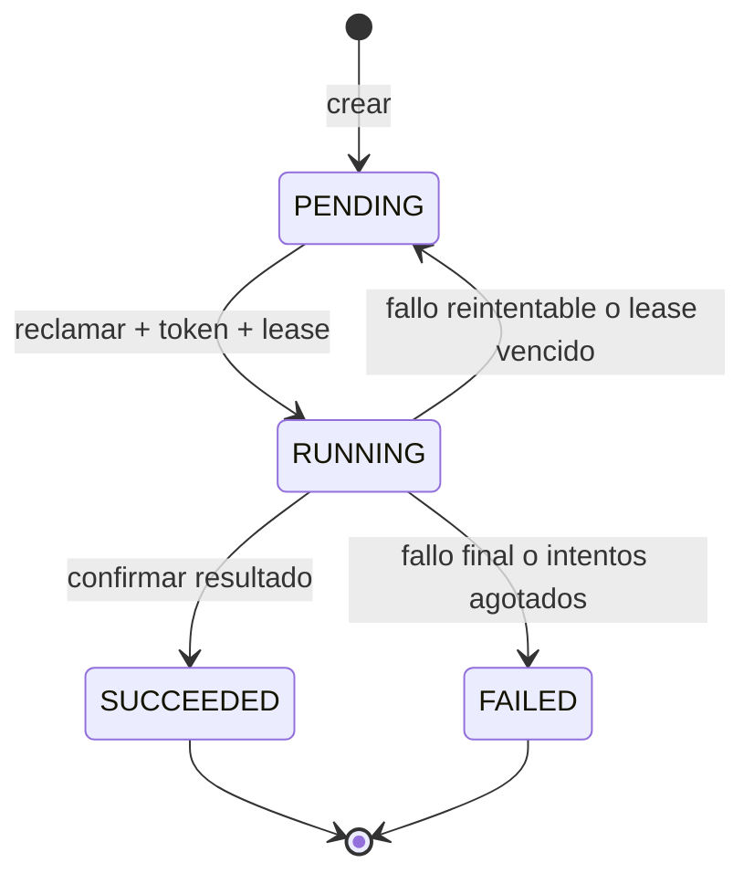

# Protocolo de trabajos

Estado: máquina de estados y worker implementados con adaptadores en memoria; no
desplegados ni compartidos entre procesos.

## Invariantes

- Cada reclamación incrementa `attempts` y genera un `attempt_token` nuevo.
- Solo el worker que posee el token activo puede confirmar o fallar el intento.
- Un token deja de ser válido al vencer el lease, aunque todavía no haya reclamado
  el trabajo otro worker.
- Un lease vencido vuelve a `PENDING` mientras queden intentos; después termina en
  `FAILED`.
- El resultado solo se publica en el trabajo al pasar a `SUCCEEDED`.

El worker escribe primero el grafo y después confirma el trabajo. Si pierde el lease
entre ambas operaciones puede quedar un objeto huérfano, pero el intento antiguo no
puede publicarlo como resultado válido. En AWS los objetos se aislarán por trabajo e
intento y una política de ciclo de vida eliminará huérfanos.

## Contrato HTTP local

`POST /v1/jobs/graph-builds` valida el diccionario, crea el trabajo y devuelve 202,
`Location` y estado `PENDING`. `GET /v1/jobs/{job_id}` devuelve estado, intentos,
error y resultado. Cuando termina correctamente, `result.graph_id` identifica el
grafo consultable.

La API no ejecuta el trabajo en segundo plano por sí misma. `GraphWordWorker` es un
servicio de aplicación separado que consume `JobRepository`. En las pruebas ambos
comparten una instancia en memoria; procesos o réplicas reales no compartirían ese
estado.

## Paso pendiente para AWS

El bloqueo y la cola son atómicos únicamente porque el adaptador local usa un mismo
`RLock`. Esto no resuelve la separación DynamoDB/SQS. La siguiente persistencia debe
usar escritura condicional para reclamar y una bandeja de salida o reconciliador
persistente para recuperar el fallo entre registrar el trabajo y enviarlo a SQS.
