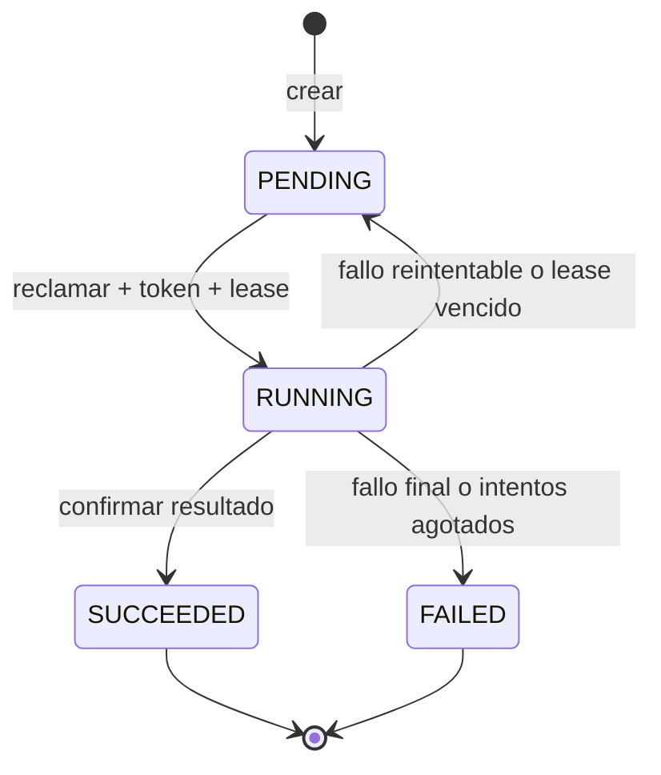

# Protocolo de trabajos

Estado: implementado en memoria, SQLite y AWS. Los adaptadores AWS se han
desplegado; véase [la validación](aws-validation.md) y [las mejoras](hardening.md).

```mermaid
stateDiagram-v2
    [*] --> PENDING: crear
    PENDING --> RUNNING: reclamar + token + lease
    RUNNING --> SUCCEEDED: confirmar resultado
    RUNNING --> PENDING: fallo reintentable o lease vencido
    RUNNING --> FAILED: fallo final o intentos agotados
    SUCCEEDED --> [*]
    FAILED --> [*]
```

## Invariantes

- Cada reclamación incrementa `attempts` y genera un `attempt_token` nuevo.
- Solo el worker que posee el token activo puede confirmar o fallar el intento.
- Un token deja de ser válido al vencer el lease, aunque todavía no haya reclamado
  el trabajo otro worker.
- Un lease vencido vuelve a `PENDING` mientras queden intentos; después termina en
  `FAILED`.
- El resultado solo se publica en el trabajo al pasar a `SUCCEEDED`.

El worker escribe primero el grafo y después confirma el trabajo. Si pierde el lease
entre ambas operaciones puede quedar un objeto huérfano, pero el intento antiguo no
puede publicarlo como resultado válido. En AWS cada guardado usa un UUID nuevo.
No existe todavía recolección automática de objetos huérfanos.

## Contrato HTTP local

`POST /v1/jobs/graph-builds` valida el diccionario, crea el trabajo y devuelve 202,
`Location` y estado `PENDING`. `GET /v1/jobs/{job_id}` devuelve estado, intentos,
error y resultado. Cuando termina correctamente, `result.graph_id` identifica el
grafo consultable.

La API no ejecuta el trabajo en segundo plano por sí misma. `GraphWordWorker` es un
servicio de aplicación separado que consume `JobRepository`. El adaptador SQLite
permite que la API y uno o más workers locales abran conexiones independientes al
mismo fichero. `BEGIN IMMEDIATE` serializa la selección y actualización de un
trabajo, impidiendo una doble reclamación.

## Implementación AWS

En SQLite, catálogo y cola son filas de una misma base y crear `PENDING` es una sola
transacción. Esto no resuelve la separación DynamoDB/SQS. Los adaptadores AWS usan
escritura condicional por revisión para reclamar y un reconciliador periódico
para recuperar el fallo entre registrar el trabajo y enviarlo a SQS.
El heartbeat renueva el lease y la visibilidad mientras el worker calcula.
Los POST asíncronos admiten `Idempotency-Key`; detalles en [hardening.md](hardening.md).
